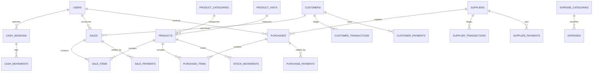

# Store POS & Management System — Database Schema Design

## 1. Database Specifications
- **Database Engine:** MySQL / MariaDB (InnoDB)
- **Database Name:** `store_pos`
- **Character Set / Collation:** `utf8mb4` / `utf8mb4_unicode_ci`
- **Monetary Precision:** `DECIMAL(12,2)`
- **Quantity Precision:** `DECIMAL(12,3)` (supports fractional units like kg/liters)

---

## 2. Complete Entity-Relationship Overview

---

## 3. Entity Definitions & Schemas

### 3.1. Authentication & Users
#### `users`
| Column | Type | Attributes | Description |
|---|---|---|---|
| `id` | BIGINT UNSIGNED | PK, Auto Increment | User Identifier |
| `name` | VARCHAR(255) | NOT NULL | Full Name |
| `email` | VARCHAR(255) | UNIQUE, NOT NULL | Login Email |
| `password` | VARCHAR(255) | NOT NULL | Bcrypt Hashed Password |
| `role` | ENUM | 'admin', 'manager', 'cashier' | User Role |
| `status` | ENUM | 'active', 'inactive' | Account Status |
| `created_at` | TIMESTAMP | NULLABLE | Timestamp |
| `updated_at` | TIMESTAMP | NULLABLE | Timestamp |

---

### 3.2. Products & Inventory
#### `product_categories`
| Column | Type | Description |
|---|---|---|
| `id` | BIGINT UNSIGNED | PK |
| `name` | VARCHAR(255) | Category Name (e.g. مشروبات, مواد غذائية) |
| `code` | VARCHAR(50) | Optional unique code |
| `description` | TEXT | Description |

#### `product_units`
| Column | Type | Description |
|---|---|---|
| `id` | BIGINT UNSIGNED | PK |
| `name` | VARCHAR(100) | Unit Name (قطعة, كرتون, كيلوجرام) |
| `short_name` | VARCHAR(20) | Symbol (قطعة, كغ, حبة) |

#### `products`
| Column | Type | Attributes | Description |
|---|---|---|---|
| `id` | BIGINT UNSIGNED | PK | Product ID |
| `category_id` | BIGINT UNSIGNED | FK -> product_categories | Category |
| `unit_id` | BIGINT UNSIGNED | FK -> product_units | Measurement Unit |
| `name` | VARCHAR(255) | NOT NULL, INDEX | Product Name |
| `barcode` | VARCHAR(100) | UNIQUE, INDEX, NULLABLE | Barcode / SKU |
| `cost_price` | DECIMAL(12,2) | NOT NULL, DEFAULT 0.00 | Purchase Cost |
| `selling_price` | DECIMAL(12,2) | NOT NULL | Selling Price |
| `tax_percent` | DECIMAL(5,2) | NOT NULL, DEFAULT 0.00 | VAT percentage |
| `stock_quantity` | DECIMAL(12,3) | NOT NULL, DEFAULT 0.000 | Current Stock Balance |
| `min_stock_alert`| DECIMAL(12,3) | NOT NULL, DEFAULT 5.000 | Reorder Level Alert |
| `is_active` | BOOLEAN | DEFAULT TRUE | Active Flag |
| `created_at` / `updated_at` | TIMESTAMP | | Timestamps |

#### `stock_movements`
| Column | Type | Attributes | Description |
|---|---|---|---|
| `id` | BIGINT UNSIGNED | PK | Movement ID |
| `product_id` | BIGINT UNSIGNED | FK -> products | Product |
| `user_id` | BIGINT UNSIGNED | FK -> users | Operator |
| `type` | ENUM | 'sale', 'purchase', 'sale_return', 'purchase_return', 'adjustment', 'damage' | Movement Type |
| `quantity` | DECIMAL(12,3) | NOT NULL | Quantity (+ or -) |
| `balance_before`| DECIMAL(12,3)| NOT NULL | Stock Before |
| `balance_after` | DECIMAL(12,3)| NOT NULL | Stock After |
| `reference_type`| VARCHAR(50)  | Model Reference (e.g. Sale, Purchase) |
| `reference_id`  | BIGINT UNSIGNED | Reference ID |
| `notes` | TEXT | Notes |
| `created_at` | TIMESTAMP | Date & Time |

---

### 3.3. Sales & POS
#### `sales`
| Column | Type | Attributes | Description |
|---|---|---|---|
| `id` | BIGINT UNSIGNED | PK | Invoice ID |
| `invoice_number` | VARCHAR(100) | UNIQUE, INDEX | POS-2026-00001 |
| `user_id` | BIGINT UNSIGNED | FK -> users | Cashier |
| `customer_id` | BIGINT UNSIGNED | FK -> customers, NULLABLE | Customer |
| `cash_session_id` | BIGINT UNSIGNED | FK -> cash_sessions, NULLABLE | Register Session |
| `subtotal` | DECIMAL(12,2) | NOT NULL | Total Before Tax & Discount |
| `tax_amount` | DECIMAL(12,2) | NOT NULL, DEFAULT 0.00 | Total VAT |
| `discount_amount` | DECIMAL(12,2) | NOT NULL, DEFAULT 0.00 | Discount |
| `grand_total` | DECIMAL(12,2) | NOT NULL | Final Invoice Amount |
| `paid_amount` | DECIMAL(12,2) | NOT NULL, DEFAULT 0.00 | Amount Paid |
| `due_amount` | DECIMAL(12,2) | NOT NULL, DEFAULT 0.00 | Remaining Debt |
| `payment_status` | ENUM | 'paid', 'partial', 'due' | Status |
| `invoice_status` | ENUM | 'completed', 'void', 'returned' | Invoice Lifecycle |
| `created_at` / `updated_at` | TIMESTAMP | | Timestamps |

#### `sale_items`
| Column | Type | Description |
|---|---|---|
| `id` | BIGINT UNSIGNED | PK |
| `sale_id` | BIGINT UNSIGNED | FK -> sales |
| `product_id` | BIGINT UNSIGNED | FK -> products |
| `product_name` | VARCHAR(255) | Historical Name Snapshot |
| `unit_cost` | DECIMAL(12,2) | Cost at time of sale |
| `unit_price` | DECIMAL(12,2) | Price at time of sale |
| `quantity` | DECIMAL(12,3) | Quantity Sold |
| `discount_amount` | DECIMAL(12,2) | Item Discount |
| `tax_amount` | DECIMAL(12,2) | Item Tax |
| `subtotal` | DECIMAL(12,2) | Item Total |

#### `sale_payments`
| Column | Type | Description |
|---|---|---|
| `id` | BIGINT UNSIGNED | PK |
| `sale_id` | BIGINT UNSIGNED | FK -> sales |
| `payment_method` | ENUM | 'cash', 'card', 'bank_transfer', 'credit' |
| `amount` | DECIMAL(12,2) | Amount Paid |
| `reference_number` | VARCHAR(100) | Card Auth / Receipt Ref |
| `created_at` | TIMESTAMP | Payment Date |

---

### 3.4. Customers, Suppliers & Debts
#### `customers`
- `id`, `name`, `phone`, `email`, `address`, `credit_limit`, `current_balance`, `created_at`

#### `customer_transactions`
- `id`, `customer_id`, `type` ('invoice', 'payment', 'return', 'adjustment'), `amount`, `balance_before`, `balance_after`, `reference_id`, `created_at`

#### `suppliers`
- `id`, `name`, `company_name`, `phone`, `current_balance`, `created_at`

#### `supplier_transactions`
- `id`, `supplier_id`, `type` ('purchase', 'payment', 'return'), `amount`, `balance_before`, `balance_after`, `reference_id`, `created_at`

---

### 3.5. Cash Sessions & Expenses
#### `cash_sessions`
- `id`, `user_id`, `opening_cash`, `closing_cash_actual`, `closing_cash_expected`, `difference_amount`, `status` ('open', 'closed'), `opened_at`, `closed_at`

#### `expenses`
- `id`, `expense_category_id`, `user_id`, `amount`, `payment_method`, `description`, `receipt_attachment`, `created_at`

#### `settings`
- `id`, `key` (UNIQUE), `value` (TEXT), `group` (e.g. 'store', 'tax', 'receipt')
